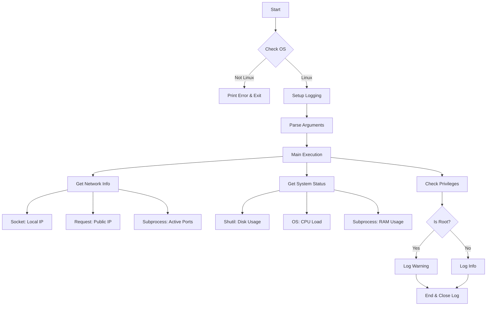
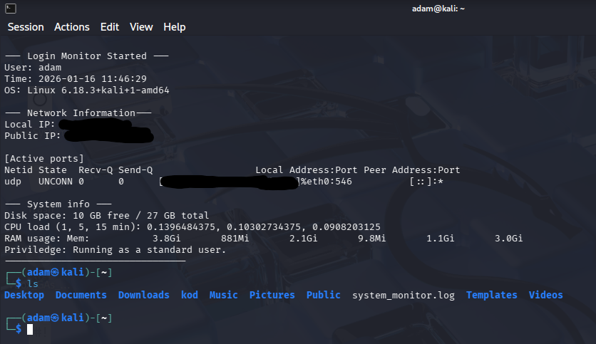

# Project script for login monitoring

## Purpose / Goal
* This project aims to be an automated script that logs most exploitable services to help with security.

## Features
* It logs network services such local ip, public ip and active ports.
* System logging such as disk usage, CPU load and RAM usage.
* Checks if user is root or standard user.
* Saves it all to to a `system_monitor.log` with timestamps. Either in `~` on terminal startup or current folder with python script.
* This while adding ease of use commands such as -h for help and -v for version.
* Pre check to see if OS is Linux-based to prevent crashes.

## System requirements
* **OS:** Linux-based enviroment
* **Python:** Python 3.10 or higher (Not recommended to run lower versions)
* **Dependencies:** Requests library for public ip lookup. installed via `pip install requests` for linux or `sudo apt install python3-requests` for Kali linux.

## Installation / Usage
* Clone my repository at `git clone https://github.com/AdamosRG/fs-script.git`
* Locate the correct folder which would be `cd fs-script/projekt`
* Make the file executable with `chmod +x login_monitor.py`
* Launch it with `sudo ./login_monitor.py`
* To make it launch on terminal startup do the follow. Add the full file path to the end of the `~/.zshrc` or `~/.bashrc` file.

### Arguments / Flags
* `-h` for help
* `-v` for version

## Flowchart of logic

##Roadmap
**Short term**
* Make it more readable, currently gives info without headers.
* Add support for other systems such as Windows.
* Make more flags and expand on the current ones.
* Expand on error codes to give solutions

**Long term**
* Switch from log file database for easier storage. 
* Check for outdated drivers.
* Check for other common exploits

##Image on startup

